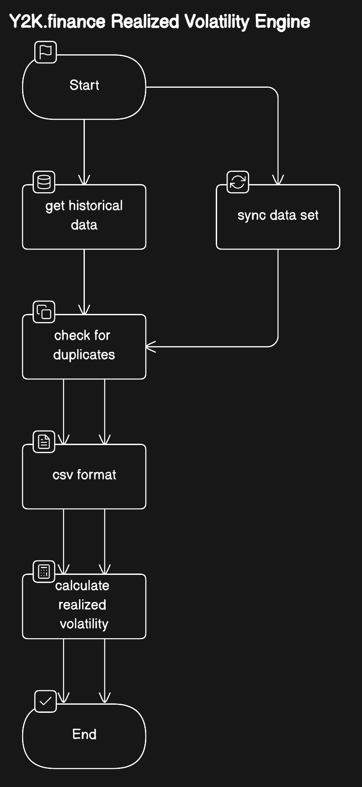

# Y2K Volatility Engine

Using onchain chainlink oracle data, which is processed in a transparent manner to calculate the realized volatility of an underlying asset, which is verified through UMA

## System Workflow

For both initial database building and database syncing, we have a similar workflow, which is defined within the first step. `get_historical_data(TICKER)` is a function for building initial historical databases using chainlink price oracles as the data source. `sync_data_set(TICKER)` is the function that is used on existing databases that need to be updated regularly

After the first step of the workflow is completed, the rest is the same for any situation (to make this as simple as possible), where we have some simple functions for checking duplicates with `check_for_duplicates(TICKER)` and csv formatting such as gwei to ether and unix to datetime converstion with `csv_format(TICKER)`

Once the data has been initialized/synced, processed and pre-parsed, we are able to calculate the volatility using `calculate_realized_volatility(TICKER)` within `utils/volatility`. This will export csv and json files of the realized volatility rating in `data/volatility` as well as exporting a figure/chart to `data/figures`

## How to run the program and validate data

### 1. Setup the project

## Install dependencies

If using python:
`pip install -r requirements.txt`

If using python3:
`pip3 install -r requirements.txt`

## Create .env file

The script uses a RPC provider to fetch data on-chain, to ensure this works create a `.env` file and add the fields displayed in the `env.example` file.

### 2. Running the script

## How to configure the correct ticker and timestamp

The ticker is set to Ethereum (ETH) by default in this project and the timestamp will be an arbitrary value.

To configure the ticker, replace the TICKER value in `main.py`. To configure the timestamp, replace the TIMESTAMP value in `main.py` with the asserted timestamp from the Uma query.

### Ticker list

The active list of tickers and the value used for their inputs in `TICKER` are:

Ethereum (ETH) - `'eth'`

Bitcoin (BTC) - `'btc'`

Arbitrum (ARB) - `'arb'`

Solana (SOL) - `'sol'`

GMX (GMX) - `'gmx'`

PENDLE (PENDLE) - `'pendle'`

### Running the command

If using python:
`python main.py`

If using python3:
`python3 main.py`

### 3. Compare the output to Uma

### Checks

The script will log a series of values to allow the asserter to ensure data is valid:

- `Latest Round` - the most recent round Id from the oracle used
- `UNIX timestamp` - the timestamp used to filter the data
- `Filter is valid` - if UTC timestamp is >= FinalRow timestamp this will be true (meaning data has been filtered correctly)
- `RV Value` - the realised volatility value for the asset and corresponding timestamp

To ensure the output is valid the asserter can check the latest round is the same as the latest round Id for the Chainlink oracle being queried (oracle address used will be logged next to latest round). The UNIX timestamp should correspond with the value in the Uma assertion used to replace `TIMESTAMP` in `main.py` and `Filter is valid` should log 'true'. Finally, the value logged for `RV value `should be scaled by `10 ^ 18` and compared against the `volatility price` in the Uma query.

### Comparison

The command will output the realized volatility as a csv in `data/volatility/` and the RV value will be logged in the console.

For example, the following lines would be seen in the csv:
'2024-01-13,0.59445218
2024-01-14,0.59254052
2024-01-15,0.59387754'

The following value would be logged for RV:
`RV value: 0.59387754`

The csv be outlining the realized volatility values on January 13th, 14th, and 15th. The value being requested will always be the last log as the timestamp should filter out all data that follows. The value of `0.59387754` logged would then be scaled up by 10^18 and compared against the volatility price assertion on Uma.
